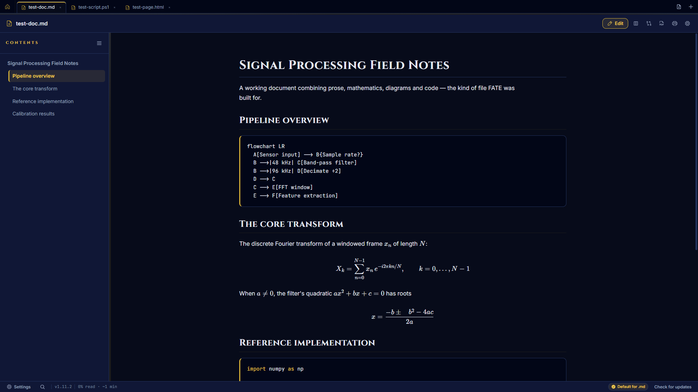
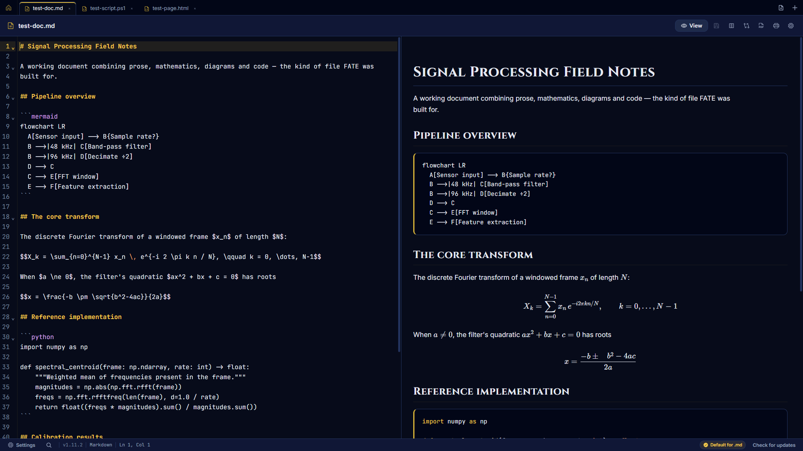
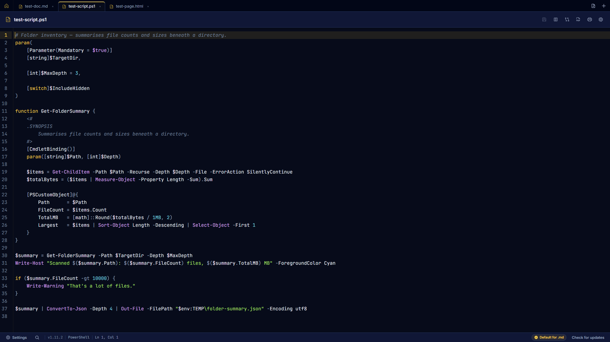
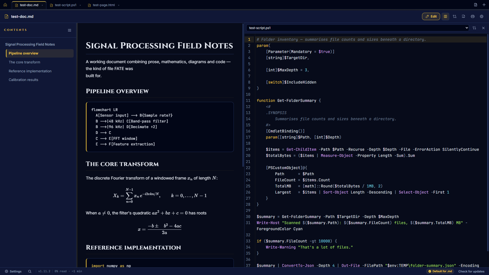
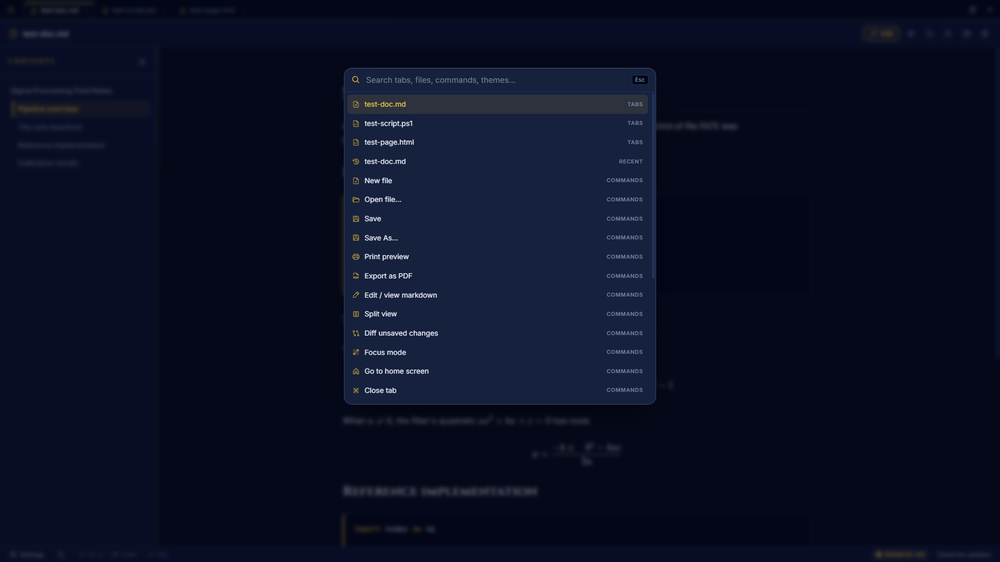
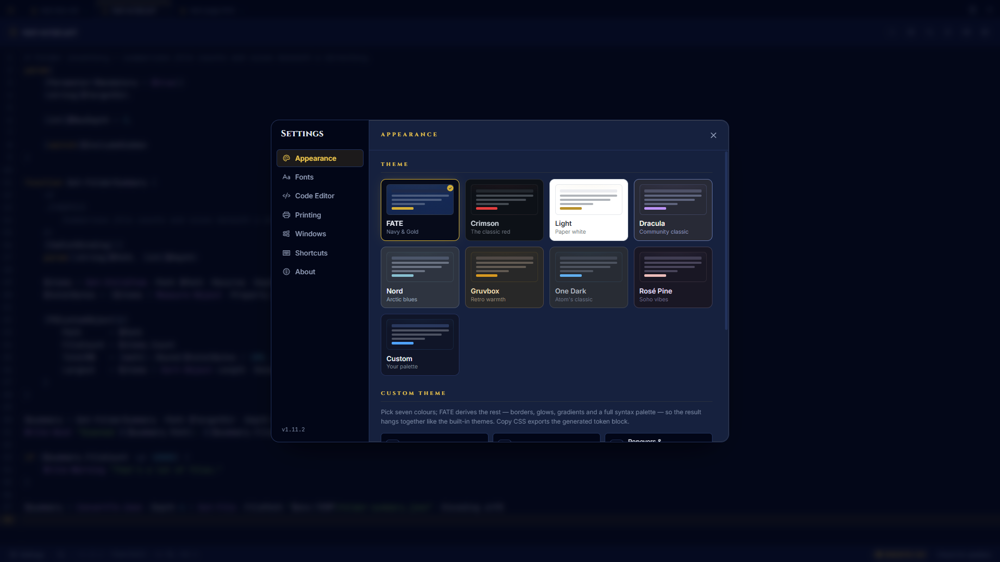
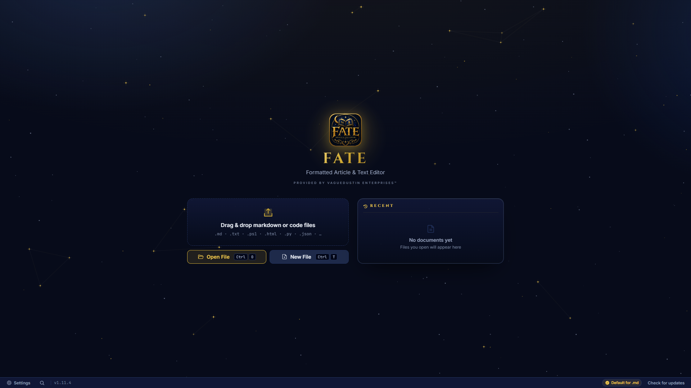

# FATE (Formatted Article & Text Editor)

FATE is a beautiful, elegant, and highly resilient Markdown viewer **and code editor** built for technical documents, research papers, and the files around them. Powered by Electron, Vite, and React, FATE delivers an instant reading experience for complex documents — and a full editing surface when you need to change them.



<table>
  <tr>
    <td width="50%"><br/><sub><b>Edit markdown with a live side-by-side preview</b></sub></td>
    <td width="50%"><br/><sub><b>A real code editor for 80+ file types</b></sub></td>
  </tr>
  <tr>
    <td width="50%"><br/><sub><b>Split view — built for wide monitors, with diff modes</b></sub></td>
    <td width="50%"><br/><sub><b>Everything one keystroke away — Ctrl+K</b></sub></td>
  </tr>
  <tr>
    <td width="50%"><br/><sub><b>Nine themes plus a custom theme builder</b></sub></td>
    <td width="50%"><br/><sub><b>The gilded home screen with its constellation sky</b></sub></td>
  </tr>
</table>

## Features & Capabilities

- **Instant Viewing:** Drag & drop any `.md` or `.markdown` file directly into the app, or set FATE as your default markdown viewer.
- **Full Code Editor:** Open and *edit* code files — `.ps1`, `.html`, `.py`, `.js`, `.json`, `.css`, `.yaml` and 80+ more — in a real editor with syntax highlighting, line numbers, code folding, search (`Ctrl`+`F`), multiple cursors and undo history. Save with `Ctrl`+`S`; unsaved changes are guarded everywhere (closing the file, opening another, closing the window).
- **Tabs:** Open any number of files side by side, Notepad++-style — mixed markdown and code, per-tab unsaved-changes tracking, middle-click to close, `Ctrl`+`Tab` to cycle, `Ctrl`+`1`–`9` to jump. Every tab keeps its scroll position, cursor and undo history while backgrounded.
- **Bundled Font Library — plus every font on your PC:** JetBrains Mono, Fira Code, Cascadia Code, Source Code Pro, IBM Plex Mono, Roboto Mono for code; Inter, IBM Plex Sans, Source Serif 4, Lora, Merriweather for prose — all shipped inside the app, fully offline — and a searchable picker over every font installed on your system. Pick fonts for the interface, markdown documents, and code separately, override the font *per file type*, and tune sizes and ligatures, all previewed live in each typeface.
- **Live Reload That Respects Your Edits:** Files changed on disk reload in place while your buffer is clean — and never clobber unsaved edits.
- **Deep LaTeX Math Support:** Perfectly renders complex inline and block mathematical equations, fractions, and multi-line matrices using KaTeX.
- **Surgical Math Auto-Repair:** FATE includes a custom algorithmic layer that detects and dynamically heals corrupted backslash escapes (e.g., `\theta`, `\begin`, `\approx`) caused by poorly escaped markdown generators before they hit the screen.
- **Interactive Table of Contents:** Automatically generates a sidebar table of contents. Headings containing math equations are flawlessly rendered directly in the sidebar!
- **Premium Aesthetics:** Deep navy surfaces with metallic gold accents, engraved Cinzel display type, and gilded hairlines — the VagueDustin Enterprises design language.
- **Four Themes:** **FATE** (navy & gold, default), **Crimson** (the classic red look), **Light**, and **Dracula**. Each theme is a single block of design tokens, so the entire UI retunes together.
- **Fully Offline:** Typefaces ship with the app. No webfont CDN, no network requests, no telemetry — see [PRIVACY.md](PRIVACY.md).
- **Print to PDF:** Need a hard copy? Print your perfectly formatted documents directly to PDF with optimized page margins and scaling — on a clean white, ink-saving background whatever theme you read in.

## Keyboard Shortcuts

FATE supports standard accessibility shortcuts to improve your reading experience:

Every shortcut below (except `Ctrl`+`1`–`9` and zoom) is rebindable in **Settings → Shortcuts**. Defaults:

| Action | Shortcut |
| --- | --- |
| **Command palette** | `Ctrl` + `K` |
| **New File** | `Ctrl` + `N` |
| **Open File** | `Ctrl` + `O` |
| **Save / Save As** | `Ctrl` + `S` / `Ctrl` + `Shift` + `S` |
| **Find in file (editor)** | `Ctrl` + `F` |
| **Edit / view markdown** | `Ctrl` + `E` |
| **Split view** | `Ctrl` + `\` |
| **Focus mode** | `Ctrl` + `Shift` + `F` |
| **Next / previous tab** | `Ctrl` + `Tab` / `Ctrl` + `Shift` + `Tab` |
| **Jump to tab** | `Ctrl` + `1`–`9` (9 = last) |
| **Close tab** | `Ctrl` + `W` or `Escape` |
| **Go home / Settings** | `Alt` + `Home` / `Ctrl` + `,` |
| **Zoom In / Out / Reset** | `Ctrl` + `+` / `-` / `0` |
| **Print preview / Export PDF** | `Ctrl` + `P` / `Ctrl` + `Shift` + `E` |

## How to Build from Source

Don't want to use the pre-compiled releases? You can easily build FATE from source:

1. **Clone the repository:**
   ```bash
   git clone https://github.com/VagueDustin/FATE.git
   cd FATE
   ```
2. **Install dependencies:**
   ```bash
   npm install
   ```
3. **Run the development server:**
   ```bash
   npm run electron:dev
   ```
4. **Compile the executable:**
   ```bash
   npm run electron:build
   ```
   The built installers will be output to the `dist-electron/` directory.

## Printing & PDF export

`Ctrl`+`P` opens a real **page-by-page preview** — actual paginated output, not a printer picker with
"This app doesn't support print preview". A separate button exports straight to PDF.

Both render through the same print stylesheet, so what you preview is what prints:

- **White paper, black ink** whatever theme you read in
- **Heading bookmarks** in exported PDFs, built from the document's own structure
- **Page numbers** and the document name in the header
- **Tagged PDF** output, so screen readers can navigate the export
- Code blocks, tables, images and block equations avoid being split across pages
- Paper size and orientation in Settings → Printing

## Contributing

Pull requests are welcome — see **[CONTRIBUTING.md](CONTRIBUTING.md)** for setup and the house rules,
and **[BRAND.md](BRAND.md)** for what the name and artwork cover. For anything non-trivial, open an
issue first. Merges are at the maintainer's discretion.

## Licence & brand

The **code** is [AGPL-3.0](LICENSE): read it, learn from it, fork it, improve it — but any version
you distribute (or serve to users over a network) must publish its complete source under the same
licence. Open source with teeth: nobody turns FATE into a closed product.

The **name and the artwork are separate from the code licence.** "FATE", "VagueDustin Enterprises",
the gilded badge and the document mark belong to VagueDustin Enterprises, and all rights in them are
reserved — see **[BRAND.md](BRAND.md)**.

In short: fork freely, keep it open, and **rename and re-skin before you distribute.**

## Changelog

### v1.11.5
- **[Bugfix]** **A custom install directory no longer gets reset on upgrade.** The installer's
  `preInit` unconditionally reseeded the remembered install location to the default publisher folder,
  so anyone who chose their own directory would be moved back to the default on every update —
  including silent auto-updates, which trust that remembered value. It now seeds the default only on
  a first install, or immediately after removing a pre-rename install.
- **[Bugfix]** **The rename migration could silently skip.** It read the remembered install location
  through `SHCTX`, which isn't reliably settled that early in `preInit`; if it resolved to HKCU while
  the old install was recorded in HKLM, the read came back empty and a pre-rename "FATE - Markdown
  Viewer" install would quietly survive beside the new one. Now reads HKLM explicitly, with an HKCU
  fallback.
- **[Licence]** FATE is now **AGPL-3.0**. Fork it, learn from it, improve it — anything you distribute
  or serve over a network ships its complete source under the same licence.
- **[Docs]** `TRADEMARK.md` is now **[BRAND.md](BRAND.md)**, rewritten to say what's actually true:
  no registered trademarks, just a brand and an alias, with artwork protected by copyright. The
  fork-and-rename checklist is current again (executable name, per-type ProgIds, the shell verb,
  store art). Contribution terms, PR and issue templates updated to match.
- **[Maintenance]** `build/installer.nsh` is now tracked in the repository — it's hand-authored build
  source, and without it a clone can't produce an installer at all. Generated icons and Store art stay
  ignored.

### v1.11.4
- **[Bugfix]** **Drag & drop actually works now — anywhere in the window.** Two root causes fixed: the drop library's file handles broke Electron's path resolution, and a drop landing outside the drop zone fell through to Chromium's default behaviour, *navigating the whole app to the dropped file*. Drops are now handled natively across the entire window (home screen, editor, tab strip — anywhere), with a gold "Release to open" overlay while dragging, and stray navigations are refused by the main process as a second line of defence.
- **[Feature]** **Broken code gets flagged as you type.** The editor now underlines regions the language parser cannot make sense of — missing brackets, unclosed strings, stray tokens — with a marker in the gutter and a tooltip on hover. Powered by each language's real parse tree, so there are no per-language lint configs and no false-positive guessing; structural parsers (JavaScript, TypeScript, HTML, CSS, JSON, Python, and most others) report precisely, and shell-style languages report nothing rather than noise. Toggle under Settings → Code Editor.

### v1.11.3
- **[Feature]** **Use any font installed on your PC.** Every font picker (interface, markdown documents, code, and per-file-type overrides) now offers the fonts installed on your system alongside the bundled library — with a search box, each candidate previewed in its own typeface, and Enter to take the top match. Selections persist as `system:<Family>` and degrade gracefully through the standard fallback stack if a font is later uninstalled. Enumeration is one local query, cached per run; nothing leaves your machine.
- **[Maintenance]** Dev/test instances can run beside an installed FATE via the `FATE_USER_DATA` environment variable (separate profile, separate single-instance lock).

### v1.11.2
- **[Bugfix]** **Mermaid diagrams now render reliably.** Two causes fixed: rendering was attempted inside hidden (backgrounded) tabs, where SVG text measurement returns zeros and mermaid fails — the pass now runs when the tab is visible and re-runs on activation; and fences are only marked processed after their SVG actually lands, so a re-render can no longer strand them.
- **[Bugfix]** **Live reload now catches atomic saves.** Most editors (VS Code included) save by writing a temp file and renaming it over the original, which arrives as a `rename` event the watcher used to ignore — FATE now re-attaches to the new file and reloads.
- **[Bugfix]** Spurious file-watch events (antivirus scans, indexing) no longer trigger pointless re-renders — a change notification with identical content is ignored, which also stops rendered diagrams from flickering back to source.

### v1.11.1
- **[Feature]** **"Edit in FATE" on the right-click menu** for every file — a classic shell verb with the FATE badge, written by both the installer and the runtime self-heal. On Windows 11 it lives under *Show more options* (the top-level modern menu requires a packaged `IExplorerCommand`, which an NSIS install cannot provide — that's why Notepad++ ships a companion MSIX for theirs).
- **[Feature]** **Settings → Windows → "Always show full context menus"**: the practical route to top-level placement — an opt-in, fully reversible per-user switch that restores Windows 11's classic right-click menu everywhere (where Edit in FATE sits at the top level), with a one-click Explorer restart to apply.
- **[Bugfix]** Every shortcut shown in a tooltip or keycap chip (tab strip, home screen, header buttons) now renders the **live binding** instead of a hardcoded default — rebind an action and its hints follow.
- **[Feature]** **Diff your unsaved changes.** The header's diff button (and `Ctrl+K` → "Diff unsaved changes") with no split open compares the current buffer against the last-saved state — side by side, chunk-aligned. With a split open it diffs the two panes as before. `Escape` exits a diff.
- **[Enhancement]** New file default shortcut is now `Ctrl`+`T` (browser-style; rebindable as ever).
- **[Bugfix]** The font picker opens upward when it sits near the bottom of the Settings pane instead of clipping into the modal edge.
- **[Bugfix]** The registry self-heal now gates on `app.isPackaged` rather than `NODE_ENV`, so a production-mode dev run can never register ProgIds pointing at the development toolchain's electron.exe.
- **[Fixed]** About-page copyright now credits VagueDustin Enterprises.

### v1.11.0
- **[Feature]** **Every file type gets its own gilded icon.** All 83 code extensions now carry a document icon derived from the same master artwork as the markdown mark — the navy sheet, gold border and folded corner are pixel-identical; the M↓ gives way to the extension set in gold (`PS1`, `PY`, `JS`, `GRAPHQL`, …). Generated by script from the master (`npm run icons`), shipped in `resources\fileicons\`, and wired through one ProgId per type (`FATE.py`, `FATE.ps1`, …) so Explorer shows the right icon the moment FATE becomes a type's default. Existing associations made on earlier builds keep working via the legacy shared ProgId.
- **[Rebrand]** **FATE is now the *Formatted Article & Text Editor*.** The window title, taskbar, installer, Windows registration and Store metadata all carry the new name. Open documents title the window with **just the filename** (plus the unsaved `•`); the full name shows on the home screen. The app now installs to `C:\Program Files\VagueDustin Enterprises\FATE`, and the installer silently removes any pre-rename install first (cleaning up its directory), so the two never coexist.
- **[Feature]** **New files.** `Ctrl`+`N` (or the tab-strip/home buttons) opens an untitled buffer; saving offers **every supported format**, and the editor re-detects its language from the extension you choose — buffer, cursor and undo history survive the naming.
- **[Feature]** **Command palette** (`Ctrl`+`K`): one fuzzy search across open tabs, recent files, every command, and every theme.
- **[Feature]** **Markdown edit mode.** A labelled **Edit** button (and `Ctrl`+`E`) switches a markdown tab from the reading view to a split source editor with **live preview**; save with `Ctrl`+`S`, switch back to **View** and the reading view reflects your edits instantly.
- **[Feature]** **Split view** (`Ctrl`+`\`): any two open tabs side by side — built for ultrawides. The right pane has its own document selector, and a **Diff** toggle renders a chunk-aligned, syntax-highlighted comparison of the two panes (CodeMirror merge view, read-only snapshots).
- **[Feature]** **Every shortcut is rebindable** in Settings → Shortcuts — sixteen actions with conflict detection and one-click reset. `Ctrl`+`1`–`9` stays fixed.
- **[Feature]** **Four new themes** — Nord, Gruvbox, One Dark, Rosé Pine, each with its full syntax palette — plus a **custom theme builder**: pick seven colours, FATE derives the other ~30 tokens (borders, glows, gradients, syntax colours) and can export the generated CSS block.
- **[Feature]** **Mermaid diagrams** render inside markdown (```mermaid fences), fully offline, theme-aware, loaded lazily only when a document contains one.
- **[Feature]** **Session restore** (Settings → Appearance): reopen last session's tabs on launch. **Focus mode** (`Ctrl`+`Shift`+`F`): nothing but the document. **Reading time** joins the % read readout.
- **[Feature]** **Microsoft Store builds now handle updates honestly.** electron-updater cannot update an AppX, so the Store build never starts it — the update button routes to the Store's own downloads page and Settings says so, instead of a check that pretends and fails.
- **[Bugfix]** **The file-type coverage counter now counts the way Explorer decides** — user choice, then class default, then sole registered handler — instead of user choice alone, which under-reported (3 vs the real 22 on the author's machine; the sole-handler rule also exposed a classic PowerShell one-element-array unwrap bug, fixed). **Claim file types** takes every extension no app owns (per-user, one click, fully reversible from the same page); types owned by another app deep-link to FATE's page in Windows Settings — which now actually opens on FATE's page (the deep link needed `registeredAppMachine`, not `registeredAppUser`, for a per-machine registration).
- **[Bugfix]** **Registration self-heals.** The app asserts its per-user file-type registration at launch (ProgIds pointing at the running executable), so a raced upgrade, a moved install directory, or a vanished HKLM key can no longer leave "Open with FATE" broken. Discovered after an uninstall/reinstall cycle left ProgIds referenced by UserChoice with no command.
- **[Bugfix]** The installer's ".md default" checkbox is gone — defaults are managed from Settings → Windows, which is the only place that can actually set them on Windows 11 anyway.
- **[Bugfix]** KaTeX's stylesheet import was lost in the 1.10.0 refactor, which made every equation render twice (once as maths, once as raw MathML text). Restored, with a comment explaining why it is load-bearing.

### v1.10.0
- **[Feature]** **Tabs.** Open any number of files at once, Notepad++-style — markdown and code mixed freely. Every pane stays alive while backgrounded, so scroll position, cursor, selection and undo history survive tab switches. `Ctrl`+`Tab`/`Ctrl`+`Shift`+`Tab` cycles, `Ctrl`+`1`–`9` jumps (9 = last), `Ctrl`+`W` or `Escape` closes, middle-click closes, and the badge button returns to the home screen without closing anything. Opening an already-open file activates its tab instead of duplicating it. Per-tab dirty dots; the window guard arms if *any* tab has unsaved edits.
- **[Feature]** **A bundled font library, and font settings done properly.** Six code faces (JetBrains Mono — the new default, Fira Code, Cascadia Code, Source Code Pro, IBM Plex Mono, Roboto Mono) and five prose faces (Inter, IBM Plex Sans, Source Serif 4, Lora, Merriweather) ship inside the app — latin subsets only, fully offline, no CDN. Separate choices for interface, markdown documents, and code; text-size sliders for documents and the editor; a ligatures toggle; and **per-file-type overrides** so `.ps1` can render in Cascadia while `.py` uses Fira Code, per tab, live.
- **[Feature]** **Settings, redesigned.** A navigation rail with seven sections replaces the single scrolling column. Theme cards render each theme *from its own design tokens* (`data-theme` scoping) rather than hand-kept swatches; the font picker renders every face in itself with a live sample line — ligatures visible before you commit.
- **[Feature]** **Windows file associations for every supported type.** The installer registers a `FATE.CodeFile` ProgId and adds it to each of the 83 code extensions' "Open with" lists — *politely*: no extension's default handler is touched at install time. All types are declared on FATE's page in Windows Settings → Default apps, where you assign them yourself; Settings → Windows shows live coverage ("N of 86 file types currently open with FATE").
- **[Bugfix]** **Markdown code fences hadn't been syntax-highlighted since the marked v5 upgrade.** The `highlight` option FATE passed was removed from marked years ago — it parsed fine and did nothing, while a hard-coded dark stylesheet shipped for markup that never existed (and would have been unreadable in the Light theme if it had). Fences now highlight through `marked-highlight`, and the colours come from the same `--syn-*` theme tokens the code editor uses — a ```powershell fence and an open `.ps1` tab are coloured identically, in every theme.
- **[Performance]** The renderer bundle dropped ~720 KB by importing highlight.js's common-languages build instead of all ~190 languages.
- **[Enhancement]** Multiple files can be dropped onto the home screen at once — each opens in its own tab.
- **[Bugfix]** Print/PDF export with multiple tabs open renders only the active tab, never a concatenation.

### v1.9.0
- **[Feature]** **Full code viewing and editing.** FATE now opens code files — `.ps1`, `.html`, `.py`, `.js`, `.ts`, `.json`, `.css`, `.yaml`, `.sql`, `.sh`, `.bat` and 80+ more, plus extensionless standards like `Dockerfile` and `.gitignore` — in a real editor built on CodeMirror 6: syntax highlighting, line numbers, code folding, bracket matching, search & replace (`Ctrl`+`F`), multiple cursors, and full undo history. Markdown keeps its reading view; the two never mix.
- **[Feature]** **Languages load lazily and entirely offline.** Each language ships inside the app as its own chunk and is loaded only the first time a file of that type is opened. No CDN, no network — the PRIVACY.md promise holds.
- **[Feature]** **Saving, done carefully.** `Ctrl`+`S` (or the header button) writes back to disk; the window title carries the standard `•` unsaved marker. Unsaved changes are guarded at every exit: closing the file, opening another (from any path — dialog, recents, drag & drop, file association, a second instance), and closing the window all confirm first. A failed save keeps the guards armed.
- **[Feature]** **Live reload that respects your edits.** An external change reloads a clean editor in place (cursor and undo history preserved). If the buffer is dirty, your edits win and the change is noted in the status bar instead. FATE's own saves are filtered out of the watcher entirely, so saving never bounces back as a fake external change.
- **[Feature]** **Syntax colours are theme tokens.** Each of the four themes defines its own `--syn-*` palette — gold-led for FATE, GitHub-dark for Crimson, GitHub-light for Light, the official spec palette for Dracula — so switching themes retunes the highlighted code instantly, like every other surface.
- **[Feature]** **Printing and PDF export work for code too.** The editor virtualises long files (only visible lines exist in the DOM), so printing renders the full buffer through a print-only path instead — black monospace on white, wrapped long lines, same headers, footers and page setup as markdown.
- **[Feature]** The status bar shows the detected language and a live `Ln, Col` readout (written straight to the DOM, per the house scroll-performance rule). New Settings → Code Editor group: wrap long lines, indent size.
- **[Enhancement]** The open dialog gains proper filters (All supported / Markdown / Code / All files), the dropzone accepts code files, recents show a code icon for code files, and the command line / "Open with" accepts every supported extension — previously it was hard-wired to `.md`.
- **[Enhancement]** Dropped files with a resolvable path now route through the main process like every other open, so drag & drop gets live reload, recents, and the unsaved-changes guard too.
- **[Bugfix]** Binary files and files over 25 MB are refused with a clear error instead of being fed to the renderer as garbage.

### v1.8.2
- **[Bugfix]** **"Manage" / "Set as default" did nothing when clicked.** It shelled out to the Windows shell's Open-With dialog (`rundll32 shell32.dll,OpenAs_RunDLL`), and Windows *suppresses that dialog entirely* once a file type already has a confirmed handler — so the moment FATE genuinely became the default for `.md`, the button became a silent no-op. Correct invocation, valid file, no dialog, no error.
- **[Bugfix]** That dialog was the wrong tool regardless: on Windows 11 its only button is **"Just once"**, so it could never actually set a default. The button now opens Windows Settings, which is the only surface on Windows 11 that can.
- **[Feature]** **FATE is now a properly registered Windows application.** The installer writes a `Capabilities` key and a `RegisteredApplications` entry — the documented mechanism electron-builder omits. That gives FATE its own page in Settings → Default apps, and makes "Set as default" deep-link straight to it instead of dumping you on the full alphabetical list. Registered regardless of the install checkbox, since declaring that FATE *can* open Markdown is not the same as claiming the extension.
- **[Bugfix]** A failure to open Windows Settings now surfaces in the status bar. Nothing in this path is allowed to fail silently any more.

### v1.8.1
- **[Bugfix]** **Exported PDFs printed table rows in navy on white paper.** The print stylesheet reset colours element by element and had missed `table tr` (which uses the app's dark surface tokens), the table cell borders, `hr`, and the blockquote tint — so black text landed on a near-black background. Confirmed by decompressing the PDF content stream: rows were being filled `#070B1A`. The reset is now a blanket one — every background inside the document is zeroed and only deliberate light values are added back, so anything added in future is print-safe by default.
- **[Bugfix]** `printBackground` was set to `false` on the reasoning that the stylesheet forces white paper anyway. It was doing nothing: the stylesheet also sets `print-color-adjust: exact`, which overrides that flag and forces backgrounds to paint. The flag is now `true` and honest about it, with the stylesheet as the single source of truth — which means tables keep light zebra striping and code blocks a grey background, both of which help on paper.
- **[Bugfix]** **Ticking "make FATE the default for .md" during install stopped working in 1.7.0.** The installer's un-associate branch keyed off a variable that is only assigned when the custom install page actually runs; if it didn't, the empty value compared unequal to "checked" and the branch fired on every install. That was harmless while it deleted keys that never existed — but 1.7.0 corrected it to delete the real ones, at which point the latent bug began actively stripping the association. It now defaults to "checked" and only an explicit uncheck un-associates.
- **[Bugfix]** That same branch also deleted the `Markdown Document` ProgId outright, taking FATE's open command and icon with it — which removed FATE from the Windows "Open with" list entirely and let Windows fall back to another handler. Declining the checkbox now releases the `.md` claim while leaving FATE registered and selectable.
- **[Bugfix]** Settings could report "FATE currently opens .md files" when it didn't. If the ProgId resolved to no command — exactly the broken state above — the check fell back to matching the ProgId *name* and returned a false positive. A ProgId with nothing to run is no longer treated as a default.
- **[Enhancement]** Wide tables and long block equations shrink to the page instead of being cropped at the margin, and block equations avoid being split across pages.

### v1.8.0
- **[Feature]** **Print preview actually works.** `Ctrl`+`P` now opens a real page-by-page preview instead of the Windows dialog reporting *"This app doesn't support print preview"* — Electron ships Chromium without the print-preview UI, and no flag turns it on. FATE now renders the document to a PDF through its own print stylesheet and previews that, so what you see is exactly what prints.
- **[Feature]** **Export as PDF** — a dedicated button in the document header, saving wherever you choose.
- **[Feature]** Exported PDFs carry **heading bookmarks** generated from the document's own structure, **page numbers**, the document name in the header, and **tagged-PDF** structure so screen readers can navigate them.
- **[Feature]** **Paper size and orientation** in Settings → Printing: Letter, A4, Legal, Tabloid, A3, A5, portrait or landscape. Applies to both preview and export.
- **[Removed]** **The "Show filename on Discord" option is gone.** Broadcasting the name of whatever file you have open to your entire friends list is a poor default for a documents app and not something worth a setting. Rich Presence is unchanged otherwise — it still shows that you're reading or idle, exactly as it did with the option switched off. The filename no longer even crosses the internal IPC boundary, and the stale setting is cleaned out of existing configs on upgrade.
- **[Bugfix]** Print and export are gated while a render is in flight, and a failed render now surfaces in the status bar instead of failing silently.
- **[Bugfix]** If Chromium's embedded PDF viewer is unavailable in a given build, the preview falls back to the system PDF handler rather than opening an empty window.
- **[Bugfix]** Fixed a temporal-dead-zone crash introduced while wiring the print shortcut: the keyboard effect named a `const` callback declared further down the component, which threw on every render and blanked the entire app. Caught before release.
- **[Bugfix]** The print shortcut could print under the *previous* document's header. Opening a second document while already reading doesn't change the viewing state, so the shortcut's effect never re-ran and held a stale filename.

### v1.7.0
- **[Feature]** **Animated constellation sky** behind the home screen — twinkling starfield, larger constellation stars with cross glints, faint linking lines, the occasional meteor, and a slow gold halo breathing behind the badge. Ported from the [702 Squad](https://palworld.702squad.com) portal, the ceremonial-tier expression of the same brand.
  - Home screen only. Nothing animates behind a document you're reading — the loop is torn down the instant one opens.
  - Follows the active theme: gold in FATE, red in Crimson, violet in Dracula, dark gold on Light.
  - Pauses entirely while the window is hidden, and honours `prefers-reduced-motion` by rendering one static frame.
- **[Bugfix]** **Fixed the default-app check, which was always wrong.** FATE reported "no app is set for `.md` files yet" even when Windows plainly had FATE as the handler. Two causes: it read `HKCU\Software\Classes\.md\UserChoice`, a key that doesn't exist on Windows 10 or 11 — the real one lives under `Explorer\FileExts\.md` — and it compared against a ProgId (`FATEMarkdownViewer.md`) that was never registered. The actual ProgId is `Markdown Document`.
- **[Enhancement]** Detection no longer trusts the ProgId name. "Markdown Document" is generic enough that another app could claim it, so FATE now resolves the ProgId's open command and checks it actually points at FATE's own executable — answering "would double-clicking a `.md` file open *me*?" rather than a proxy for it.
- **[Enhancement]** **"Set as default" now opens the Windows Open-With dialog**, which has the "Always use this app" checkbox — one dialog, one tick, done. It previously deep-linked to the Default apps page with a parameter Windows ignored (there's no `RegisteredApplications` entry), so you landed on the full list and had to search `.md` by hand. The Settings page remains the fallback.
- **[Bugfix]** **The window and taskbar now read "FATE - Markdown Viewer"** instead of a bare "FATE". Windows truncates the taskbar label from the *start* of the window title, so the app name has to lead it; title composition moved into the main process so the renderer can't set a wrong one. Pinned shortcuts get an explicit name too.
- **[Feature]** Opened the repo to contributions: `CONTRIBUTING.md`, `TRADEMARK.md`, PR and issue templates. Code stays MIT; the name and artwork are explicitly reserved.
- **[Bugfix]** The starfield's rebuild was debounced with `requestAnimationFrame`, which never fires while a window is hidden — a resize or theme change made while minimised was dropped and never applied. Debounced with a timer instead, and a `MutationObserver` on `data-theme` now repaints on theme switch rather than waiting for a resize.

### v1.6.0
- **[Feature]** New **gilded badge artwork** across every surface — window and taskbar icon, installer, Add/Remove Programs entry, Microsoft Store tiles, the home screen, and the About panel. Matching document mark for `.md` file associations. All sizes are derived from two masters in `brand/` by `npm run icons`.
- **[Feature]** **Set FATE as your default Markdown app** — Settings → Windows Integration. Shows whether FATE currently handles `.md`, re-checks whenever the window regains focus, and deep-links to the Windows Default Apps page. Windows deliberately blocks apps from claiming a file type silently, so the UI says so rather than pretending the button did it.
- **[Feature]** **Recent documents** on the home screen. The last eight files you opened, with folder and relative time, click to reopen. Files that have since moved or been deleted are shown struck through rather than silently dropped, and clicking one prunes it.
- **[Feature]** **Open File button** with its `Ctrl`+`O` shortcut shown inline — previously the only discoverable way in was to click the drop area.
- **[Enhancement]** **Rebuilt the layout as a proper app shell.** The version readout, settings gear and update button used to be absolutely positioned in the bottom corners, where they overlapped the drop area and each other once the window got small. They now live in a real status bar row at the bottom of the shell, which makes that overlap *structurally* impossible at any window size rather than something to keep tuning breakpoints against.
- **[Enhancement]** The status bar also shows live reading progress while a document is open — written straight to the DOM, so it costs nothing per scroll frame.
- **[Enhancement]** **Settings is reachable while reading.** The gear is in the viewer header alongside a new Print button; previously Settings only existed on the home screen, so you had to close your document to reach it.
- **[Enhancement]** Home screen reworked into two panes on wide windows, so the horizontal space carries the recents list instead of sitting empty. Stacks to one column below 860px, and tightens its vertical rhythm on short windows so it fits without scrolling even at the minimum size.
- **[Enhancement]** The window now has a **minimum size** (680×520). The layout is responsive down to there and simply refuses to get smaller rather than degrading.
- **[Enhancement]** Sidebar toggle, print and settings are proper icon buttons with hover, focus and title tooltips, instead of bare clickable SVGs.
- **[Bugfix]** Added a global `box-sizing: border-box`. Without it padding was added *on top of* every width and height, so a panel capped at 268px actually occupied 291px — every sized box in the app was quietly lying about its size.
- **[Bugfix]** Print styles now also reset the new shell containers, so printing from the redesigned layout still produces a clean single flow.
- **[Maintenance]** Icon masters live in `brand/` and every raster size is script-derived; nothing is hand-exported. Removed the unused `src/assets/FATE-Icon.png`.
- **[Maintenance]** NSIS installer, uninstaller and header icons are now configured explicitly instead of relying on electron-builder's fallback.

### v1.5.0
- **[Feature]** Rebuilt the interface on the **VagueDustin Enterprises design language** — deep navy surfaces, metallic gold accents, engraved Cinzel display type, gilded hairlines. Applied at the *utility* ornament tier, the tier intended for tools: no filigree, no ambient motion, density and scanning speed first.
- **[Feature]** Document headings, table headers, and section labels now set in **Cinzel**, so rendered markdown reads as typeset rather than dumped.
- **[Feature]** Added the **Crimson** theme — the pre-1.5.0 red identity, kept as an explicit choice so nobody is forced off it by the rebrand.
- **[Feature]** New navy-and-gold application and document icons, including a purpose-drawn simplified mark at 16/24px rather than a downscale that turned to mush in Explorer.
- **[Enhancement]** **Typefaces are now bundled with the app.** Cinzel and Inter ship as local assets and the Google Fonts request on every launch is gone — FATE is genuinely offline now, matching what `PRIVACY.md` already promised.
- **[Enhancement]** Rewrote the stylesheet to be entirely token-driven. Themes were previously ~300 lines of per-theme override cascade that had to be touched for every change and had already drifted; each theme is now a ~25-line block of custom properties, and `src/App.css` contains no colour literals at all.
- **[Performance]** Scrolling no longer re-renders the app. The progress bar is written straight to the DOM, the scroll handler is throttled with `requestAnimationFrame`, heading elements are cached per document instead of re-queried every frame, and listeners are registered `passive`. Scrolling a large document went from a full React commit per tick — re-rendering the whole markdown body and every KaTeX node in it — to none.
- **[Performance]** Fixed the scroll effect depending on `activeHeading`, which tore down and re-registered the scroll listener on every heading change mid-scroll.
- **[Bugfix]** Drag-and-dropped files resolve their path again, via `webUtils.getPathForFile`. Electron 32 removed `File.path`, which had silently broken relative image loading for dropped documents; files opened via the dialog or a file association were unaffected.
- **[Bugfix]** Printing now actually produces the white, ink-saving output the docs described — the previous version printed the dark theme verbatim, background included.
- **[Bugfix]** `Escape` inside the Settings modal closes the modal instead of closing the document behind it.
- **[Bugfix]** Opening a new document resets scroll progress and the heading cache, so a stale table-of-contents highlight no longer carries over from the previous file.
- **[Accessibility]** Visible focus rings on all interactive controls, and `prefers-reduced-motion` now disables every decorative animation.
- **[Maintenance]** Icons are generated from vector sources via `npm run icons` instead of being hand-exported.

### v1.4.2
- **[Bugfix]** Fixed missing Dracula theme hooks for interactive UI buttons and scrollbars.
- **[Bugfix]** Corrected Discord RPC payload mapping to accurately mask the filename when Privacy Mode is enabled.

### v1.4.1
- **[Feature]** Added the Dracula theme option.
- **[Enhancement]** Refactored Discord Rich Presence to use a "Privacy Filter" instead of completely disabling the client.
- **[Enhancement]** Added a red pulsing glow to the Settings gear icon.
- **[Bugfix]** Fixed Light theme typography contrast by applying aggressive readability overrides to markdown headers and paragraphs.

### v1.4.0
- **[Feature]** Implemented a dynamic Settings modal featuring Theme toggling, Discord RPC control, Automatic Updates toggle, and an adjustable sidebar width.
- **[Feature]** Built a dynamic keyboard shortcut re-binding system.
- **[Feature]** Added a persistent `electron-store` backend to seamlessly save all user preferences across application updates.
- **[Feature]** Added a custom NSIS installer checkbox to automatically associate FATE with `.md` and `.markdown` files.
- **[Maintenance]** Streamlined GitHub releases to exclusively publish the optimized `.exe` installer.

### v1.3.0
- **[Feature]** Fully integrated Discord Rich Presence to proudly display your reading activity.
- **[Enhancement]** Complete UI responsiveness overhaul using fluid Flexbox scaling.
- **[Enhancement]** Rebranded core identity and window titles to explicitly declare "FATE - Markdown Viewer".
- **[Enhancement]** Integrated premium square FATE app icons and rectangular FATE document icons for `.md` Windows File Explorer associations.
- **[Enhancement]** Regenerated and unified all Microsoft Appx package tile assets.
- **[Maintenance]** Completely purged all default boilerplate graphics from the source tree.


### v1.1.0
- **[Feature]** Injected dynamic auto-repair algorithms into the file parser to automatically reconstruct corrupted LaTeX string literals (such as missing `\` for `\theta`, `\approx`, and `\begin` cases).
- **[Feature]** Implemented Print to PDF functionality with correctly inverted light-theme printer styles.
- **[Feature]** Added fully scaled Microsoft Store (AppX) tile assets to replace default generic icons.
- **[Enhancement]** Enabled `nonStandard` boundaries for the KaTeX inline parser, eliminating parse failures when equations are tightly packed against punctuation or parentheses.
- **[Enhancement]** Upgraded the Table of Contents sidebar to natively render mathematical equations inside headings.
- **[Enhancement]** Styled scrollbars to match the application's premium dark red aesthetic theme.
- **[Bugfix]** Fixed viewport cutoff scaling bugs that occurred when the Table of Contents sidebar was expanded on ultrawide monitors.
- **[Maintenance]** Cleaned up build scripts and prepared the application for production release.

### v1.0.8
- **[Compliance]** Added `PRIVACY.md` and explicitly defined `displayName` in AppX build configuration for Microsoft Store validation.

### v1.0.7
- **[Minor]** Added trademark symbol to AppX publisher display name.

### v1.0.6
- **[Bugfix]** Resolved build artifact collision by disabling the portable target.

### v1.0.5
- **[Enhancement]** Bypassed CDN cache.

### v1.0.4
- **[Bugfix]** Added explicit publisher information and fixed artifact naming conventions.

### v1.0.3
- **[Bugfix]** Fixed a critical race condition, dynamically hid update UI when viewing a document, and re-enabled GPU rendering support.

### v1.0.2
- **[Feature]** Added automatic update UI and resolved Discord overlay conflicts.

### v1.0.1
- **[Enhancement]** Configured automatic updates and applied MIT licensing.

### v1.0.0
- **[Release]** Initial FATE Markdown Viewer release with Electron, React, and Vite.
