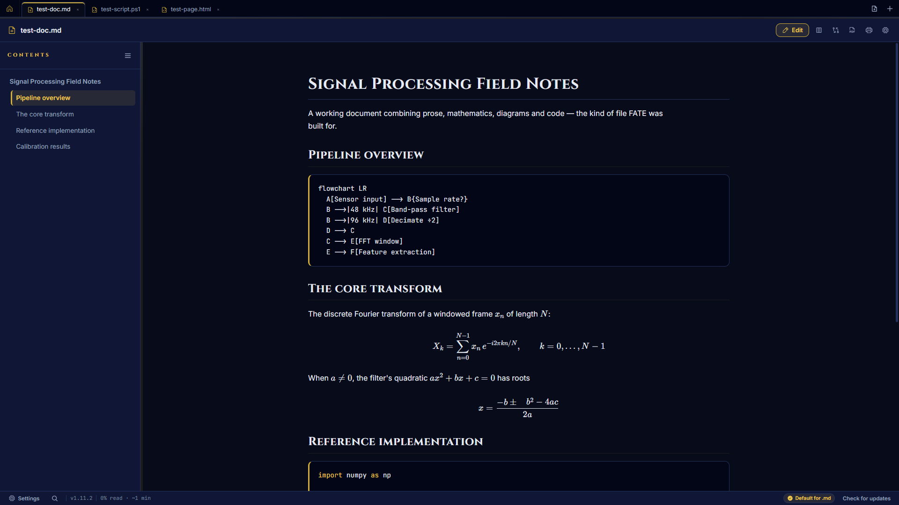
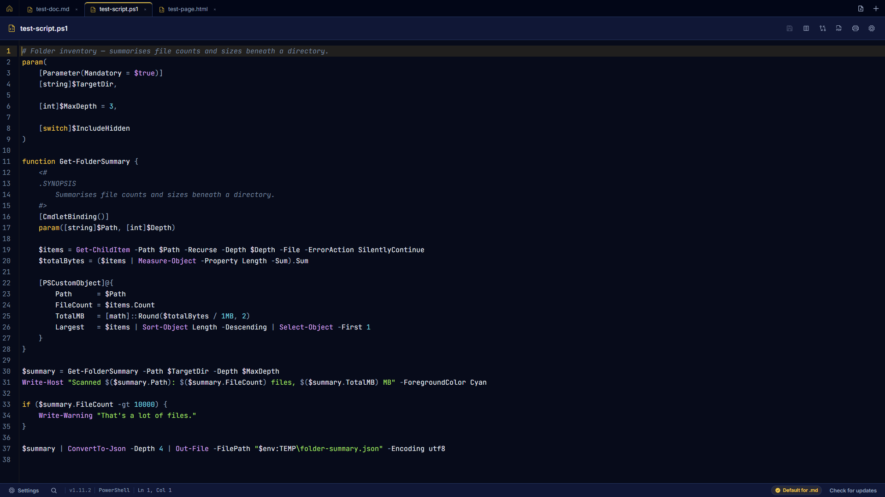
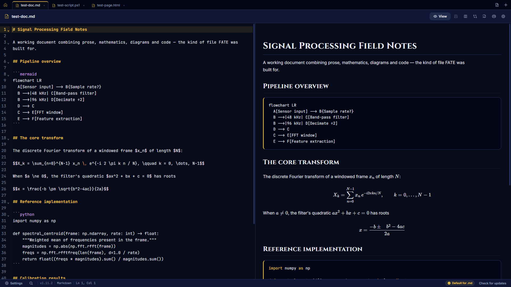
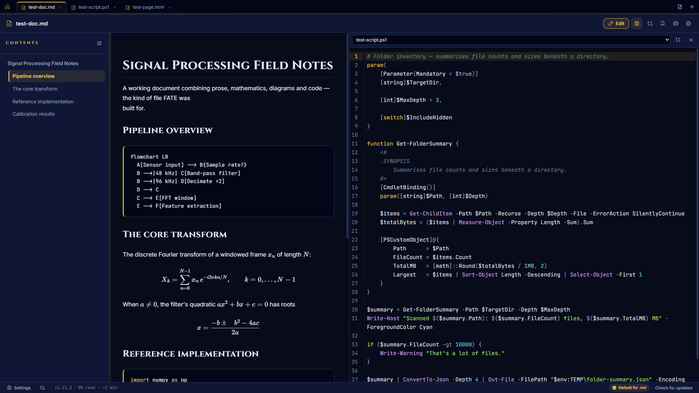
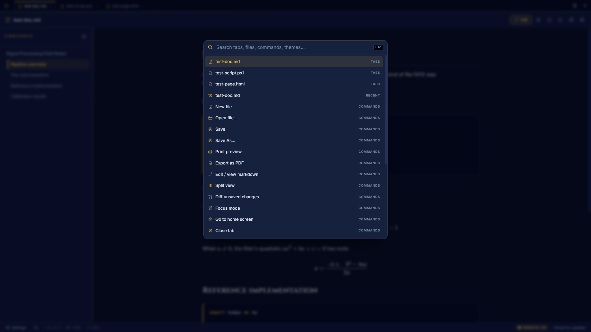
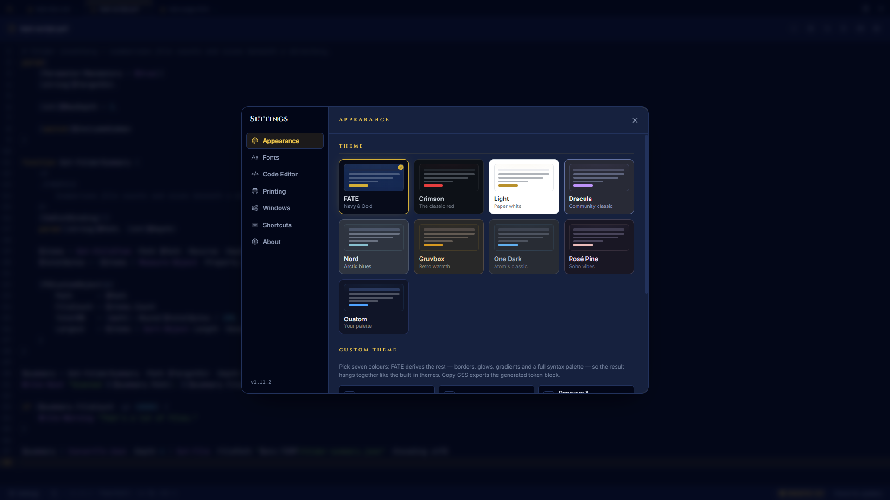
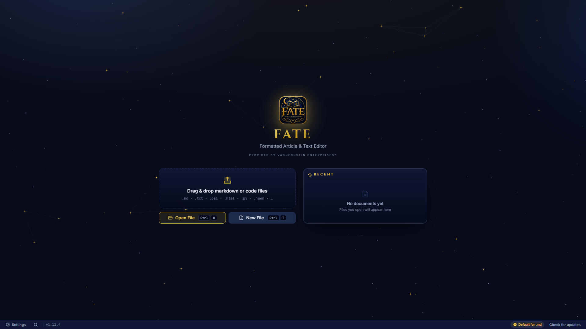

# FATE (Formatted Article & Text Editor)

[](https://github.com/VagueDustin/FATE/releases/latest)
[](https://github.com/VagueDustin/FATE/releases)
[](LICENSE)
[](#install)
[](https://apps.microsoft.com/detail/9n09hg8r34qd)
[](https://snapcraft.io/fate)

FATE is a free and open source **text editor and code editor for Windows and Linux**. It works like a
modern **Notepad++ alternative**: tabs, syntax highlighting for around 150 languages, find and replace,
multiple cursors, split view and diffs. It is also a **Markdown editor and Markdown viewer** with a live
preview that renders KaTeX math, Mermaid diagrams and highlighted code as a clean, typeset document.



## What it is

FATE opens any text file: source code, configuration files, logs, scripts, CSV exports, files with no
extension at all. Code opens in a full editor built on CodeMirror 6. Markdown opens as a formatted
document you can read, print or export to PDF, and switches to a side-by-side editor with live preview
when you want to change it. Both kinds of file sit together in the same tabs.

It runs entirely offline. Fonts and language support ship inside the app, and there is no telemetry.
The only network request FATE makes is the update check on installs that update themselves (see
[PRIVACY.md](PRIVACY.md)).

## Features

### Text and code editing

- **Opens any text file.** Nothing is gated on the extension. The only limits are a 25 MB size cap and a
  check that refuses binary files, and both explain themselves.
- **Files stay the way they were.** Line endings (CRLF or LF), encoding (UTF-8 with or without a byte-order
  mark, UTF-16 and Windows-1252) and indentation (tabs or spaces, and how wide) are detected and written
  back unchanged. The status bar shows all three, and a click converts the line endings, saves with
  another encoding, reopens a file whose encoding was guessed wrong, or switches tabs and spaces.
- **Syntax highlighting for around 150 languages**, each loaded the first time you open a file of that
  type. Files with unfamiliar extensions are detected from their content (XML and HTML prologues, JSON,
  INI sections, registry exports, shebang lines), and anything ambiguous stays plain text.
- **The editing basics done properly:** line numbers, code folding, bracket matching and auto-closing,
  auto-indent, multiple cursors, rectangular (column) selection, highlighting of other matches of the
  current selection, and full undo history.
- **Find and replace** (`Ctrl`+`F`) with match case, whole word and regular expression options.
- **Syntax errors underlined as you type**, taken from each language's own parser, so there are no lint
  configs to set up. You can turn this off in Settings → Code Editor, which also has word wrap and
  indent size.
- **Careful saving.** `Ctrl`+`S` and Save As, an unsaved marker in the title and on each tab, and a
  Save / Don't save / Cancel prompt for every unsaved tab when you close it or quit. Saves are atomic: a
  temporary file is written and swapped in, so a full disk or a dropped network share can't leave half a
  file behind.
- **Hot exit.** Unsaved work, Untitled tabs included, is backed up moments after you type and comes back
  if FATE crashes or the power goes.
- **Live reload that respects your edits.** Files changed on disk reload in place while your buffer is
  clean, keeping your place, including editors that save by writing a temp file and renaming it. Unsaved
  edits are never overwritten: a bar offers Reload, Keep mine or Compare, and a deleted file gets its own.
- **Large files and logs.** Files over 5 MB open with the heavier editor features off, and **Follow** keeps
  a growing log scrolled to its end.

### Tabs, split view and navigation

- **Tabs, Notepad++ style.** Mix Markdown and code freely. Each tab keeps its scroll position, cursor,
  selection and undo history in the background. `Ctrl`+`Tab` cycles, `Ctrl`+`1` to `9` jumps, middle-click
  closes, and right-click copies the file's path, opens its folder or closes other tabs.
- **Session restore** reopens last session's tabs on launch (optional).
- **Split view** (`Ctrl`+`\`) puts any two open tabs side by side, and a **Diff** toggle compares them
  chunk by chunk with syntax highlighting. With no split open, the same button diffs your unsaved changes
  against the saved file.
- **Command palette** (`Ctrl`+`K`): one fuzzy search across open tabs, recent files, commands and themes.
  Start with `:` to go to a line, `@` to jump to a function, class or heading, or `#` to search the text of
  every open tab.
- **An application menu** (`Alt`) with Open Recent, labelled with your own shortcuts. On Windows, opened
  files also appear in FATE's Jump List.
- **Recent files** on the home screen, **focus mode** (`Ctrl`+`Shift`+`F`) and **drag and drop** of one
  or many files anywhere in the window.
- **Every shortcut is rebindable** in Settings → Shortcuts, with conflict detection.

### Markdown preview and editing

- **Reading view** renders Markdown as a typeset document, with a table of contents sidebar, reading
  progress, reading time and **find** (`Ctrl`+`F`).
- **Edit mode** (`Ctrl`+`E`) opens the source beside a live preview that scrolls with the editor. Switch
  back and the reading view shows your edits straight away. Spell check is available here (Settings →
  Markdown).
- **Links work.** A link to another file opens it in a tab, `#anchors` scroll (headings get GitHub-style
  anchors), and web and email links open in your browser after a confirmation.
- **Copy buttons on code blocks**, and clean copies: code copies as plain text with its exact spacing,
  ready to paste into a terminal; prose copies without the theme's colours; maths copies as its TeX
  source.
- **KaTeX math**, inline and block, including fractions, multi-line matrices and equations inside
  headings (they render in the table of contents too).
- **LaTeX repair.** A repair pass fixes badly escaped backslashes (`\theta`, `\begin`, `\approx`) that
  some Markdown generators and export tools produce, inside maths only, before they reach the screen.
- **Mermaid diagrams** from `mermaid` code fences, rendered offline and matched to the current theme, in
  the reading view, split view and Edit mode's preview.
- **Highlighted code fences** that use the same colours as the code editor, so a PowerShell fence and an
  open `.ps1` file look the same.
- **Local images** referenced by relative path load correctly, names with spaces or accents included.
  **Images from the internet** load only when you allow them, for one document or always, because loading
  them tells their servers you opened the document.
- **Safe to open.** A document can't run scripts, restyle or cover the app, or navigate it away.

### Printing and PDF export

- `Ctrl`+`P` opens a real page-by-page print preview, and `Ctrl`+`Shift`+`E` exports straight to PDF.
- White paper and black ink whatever theme you use, page numbers, the document name in the header,
  heading bookmarks and tagged PDF output for screen readers.
- Code blocks, tables, images and block equations avoid splitting across pages. Code files print too.
- Paper size and orientation in Settings → Printing.

### Themes and fonts

- **Eight themes:** FATE (navy and gold, the default), Crimson, Light, Dracula, Nord, Gruvbox, One Dark
  and Rosé Pine, each with its own syntax colours.
- **A custom theme builder:** pick seven colours and FATE derives the rest. You can export the result
  as CSS.
- **Bundled fonts:** JetBrains Mono, Fira Code, Cascadia Code, Source Code Pro, IBM Plex Mono and Roboto
  Mono for code; Inter, IBM Plex Sans, Source Serif 4, Lora and Merriweather for prose. Any font
  installed on your system is available too.
- Separate font choices for the interface, Markdown documents and code, **per file type overrides**
  (Cascadia for `.ps1`, Fira Code for `.py`), text sizes and a ligatures toggle.

### Windows and Linux integration

- **Windows:** an installer that updates itself, a [Microsoft Store](https://apps.microsoft.com/detail/9n09hg8r34qd) package, file associations for more
  than 80 code types that you assign from Windows Settings → Default apps, a coverage check and repair
  tool in Settings → Windows, and an **Edit in FATE** entry on the right-click menu for every file.
- **Linux:** the [Snap Store](https://snapcraft.io/fate), AppImage, `.deb`, `.rpm`, and signed apt and dnf
  repositories. The packages register FATE for Markdown, plain text and some sixty code MIME types, so it
  appears under *Open With* and can be made the default from your file manager.

## Screenshots

<table>
  <tr>
    <td width="50%"><br/><sub><b>A code editor for any text file, with highlighting for around 150 languages</b></sub></td>
    <td width="50%"><br/><sub><b>Markdown source beside a live preview</b></sub></td>
  </tr>
  <tr>
    <td width="50%"><br/><sub><b>Split view for wide monitors, with a diff mode</b></sub></td>
    <td width="50%"><br/><sub><b>Tabs, files and commands from one search, Ctrl+K</b></sub></td>
  </tr>
  <tr>
    <td width="50%"><br/><sub><b>Eight themes plus a custom theme builder</b></sub></td>
    <td width="50%"><br/><sub><b>The home screen: open a file, start a new one, or pick up a recent one</b></sub></td>
  </tr>
</table>

## Install

The Microsoft Store on Windows and the Snap Store on Linux are the simplest way to install, and both
keep FATE updated for you. Every other download is on the
[Releases page](https://github.com/VagueDustin/FATE/releases/latest).

**Windows: Microsoft Store.** Get FATE from the
[Microsoft Store](https://apps.microsoft.com/detail/9n09hg8r34qd). The Store handles updates.

**Windows: installer.** If you'd rather not use the Store, download `FATE-Setup-<version>.exe` from the
latest release. It updates itself.

**Linux: Snap Store.** `sudo snap install fate` on Ubuntu and any distribution with snapd
([snapcraft.io/fate](https://snapcraft.io/fate)). snapd keeps it updated. To edit files on USB sticks and
other removable drives, allow it once with `sudo snap connect fate:removable-media`. FATE reminds you if
you forget.

**Ubuntu / Debian / Mint / Pop!_OS.** Install the `.deb` from the latest release, or add the repository
once. Either way, `apt upgrade` keeps FATE current:
```bash
sudo curl -fsSL -o /usr/share/keyrings/fate-archive-keyring.gpg https://github.com/VagueDustin/FATE/releases/download/apt/fate-archive-keyring.gpg
sudo curl -fsSL -o /etc/apt/sources.list.d/fate.sources https://github.com/VagueDustin/FATE/releases/download/apt/fate.sources
sudo apt update && sudo apt install fate
```
(The `.deb` registers the same repository during installation, so there is nothing to add afterwards.)

**Fedora / RHEL / openSUSE.** The same choice, `.rpm` or repository:
```bash
sudo curl -fsSL -o /etc/yum.repos.d/fate.repo https://github.com/VagueDustin/FATE/releases/download/repodata/fate.repo
sudo dnf install fate
```

**Arch / Manjaro / EndeavourOS / CachyOS.** An AUR package, `fate-editor-bin`, is on its way. Until it is
published, build the same package from a clone of this repository:
```bash
cd FATE/aur
makepkg -si
```
It repackages the released `.deb` and installs a `fate-editor` launcher. FATE's own updater stays off, so
update with `git pull` and `makepkg -si` again.

**Any Linux.** Download `FATE-<version>-x86_64.AppImage` from the latest release, `chmod +x` it and run
it. It updates itself. AppImages need FUSE 2, which some distributions no longer install by default:
`sudo pacman -S fuse2` on Arch, `sudo apt install libfuse2t64` on Ubuntu 24.04 and later.

**Flathub.** Not listed yet. The Flatpak manifest in `flatpak/` is ready and is built and linted on every
release; the Flathub submission itself has to be made by the maintainer.

Packages and repository indexes are signed. The key is `fate-archive-keyring.gpg` on the `apt` release.

## Keyboard shortcuts

Every shortcut below except `Ctrl`+`1` to `9` and zoom can be changed in **Settings → Shortcuts**.
Defaults:

| Action | Shortcut |
| --- | --- |
| **Command palette** | `Ctrl` + `K` |
| **New file** | `Ctrl` + `T` |
| **Open file** | `Ctrl` + `O` |
| **Save / Save As** | `Ctrl` + `S` / `Ctrl` + `Shift` + `S` |
| **Find and replace (editor)** | `Ctrl` + `F` |
| **Edit / view Markdown** | `Ctrl` + `E` |
| **Split view** | `Ctrl` + `\` |
| **Focus mode** | `Ctrl` + `Shift` + `F` |
| **Next / previous tab** | `Ctrl` + `Tab` / `Ctrl` + `Shift` + `Tab` |
| **Jump to tab** | `Ctrl` + `1` to `9` (9 = last) |
| **Close tab** | `Ctrl` + `W` or `Escape` |
| **Go home / Settings** | `Alt` + `Home` / `Ctrl` + `,` |
| **Zoom in / out / reset** | `Ctrl` + `+` / `-` / `0` |
| **Print preview / Export PDF** | `Ctrl` + `P` / `Ctrl` + `Shift` + `E` |

## Building from source

You need [Node.js](https://nodejs.org/) (CI uses Node 22) and git.

1. **Clone the repository:**
   ```bash
   git clone https://github.com/VagueDustin/FATE.git
   cd FATE
   ```
2. **Install dependencies:**
   ```bash
   npm install
   ```
3. **Run it in development mode** (Vite and Electron together, with hot reload):
   ```bash
   npm run electron:dev
   ```
4. **Check your work:**
   ```bash
   npm run lint
   npm run build
   ```
5. **Build the Windows installer and Store package:**
   ```bash
   npm run icons
   npm run electron:build
   ```
   The output goes to `dist-electron/`. The **Build Windows** GitHub Actions workflow
   (`.github/workflows/build-windows.yml`) builds the same on every release tag.
6. **Build the Linux packages (AppImage, `.deb` and `.rpm`):**
   ```bash
   npm run icons
   npm run electron:build:linux
   ```
   Run `npm run icons` first, because the icon set lives in the gitignored `build/` directory and is
   generated from the tracked masters in `brand/`. The `.rpm` needs `rpmbuild` (`sudo apt install rpm`
   on Ubuntu; Fedora has it already). A local Linux build also needs the public signing keyring in
   `build/`, because the `.deb` and `.rpm` ship it:
   `curl -fsSL -o build/fate-archive-keyring.gpg https://github.com/VagueDustin/FATE/releases/download/apt/fate-archive-keyring.gpg`,
   and the same for `fate-archive-keyring.asc` (CI derives both from the signing secret).

   Build Linux packages on Linux, or let the **Build Linux** GitHub Actions workflow
   (`.github/workflows/build-linux.yml`) do it. Cross-building from Windows stops at
   `dist-electron/linux-unpacked/`: the AppImage step creates symlinks, which Windows only allows with
   Developer Mode on or from an elevated shell, and the `.deb` step needs `fpm` installed as a Ruby gem.

### Making FATE the default on Linux

The `.deb` and `.rpm` install `FATE.desktop` with a `MimeType=` line covering Markdown, plain text and
the code types FATE registers on Windows, plus AppStream metadata
(`build/com.vaguedustin.fate.metainfo.xml`) for GNOME Software and KDE Discover. Defaults are per user
and set the same way as for any other editor: in GNOME Files, *Properties → Open With → FATE → Set as
default*; in KDE Dolphin, *Properties → File Type Options*; or from a shell,
`xdg-mime default FATE.desktop text/markdown` (or any of the listed types). File types the system's MIME
database doesn't know (`.jsonc`, `.psm1`, `.zig` and so on) are detected as `text/plain`, which FATE also
declares. The AppImage is a single portable file and does not integrate on its own; use AppImageLauncher
or Gear Lever if you want it in the menu and the *Open With* list.

### Releases

Releases are cut by the maintainer: bump the version, then
`gh release create vX.Y.Z --title ... --notes ...`. That creates the tag, and two workflows build and
publish everything from it. **Build Windows** (`.github/workflows/build-windows.yml`) builds the NSIS
installer and the Microsoft Store `.appx`, attaches `FATE-Setup-X.Y.Z.exe` and `latest.yml` to the
release, and keeps the `.appx` on the run for the Store submission. **Build Linux** builds and attaches
the AppImage, `.deb`, signed `.rpm` and `.snap`; republishes the apt and dnf repositories; uploads the
snap to the Snap Store; builds and lints the Flathub manifest; and installs `fate` from the live
repositories in Debian and Fedora containers as a smoke test. *Run workflow* on a branch builds
everything and attaches it to the run only. The AppImage updates itself through `latest-linux.yml`, the
same way the Windows installer uses `latest.yml`; the `.deb` and `.rpm` update through the package
manager. For the ten minutes or so before the workflows attach those two files, update checks report
them missing and succeed on the next check. A release created with a locally built installer
(`gh release create vX.Y.Z FATE-Setup-X.Y.Z.exe latest.yml ...`) still works: Build Windows leaves
those files in place.

One-time setup, all in the repository: `scripts/setup-signing-key.sh` creates the
`FATE_GPG_PRIVATE_KEY` secret, and `scripts/setup-snap-store-token.ps1` creates the
`SNAPCRAFT_STORE_CREDENTIALS` secret through Canonical's snapcraft container.

## Contributing

**Pull requests are welcome.** Bug fixes, support for more file types, editor features, Linux packaging
and documentation all help. Small fixes can go straight to a PR; for anything larger, open an issue
first so we can agree on the approach. [CONTRIBUTING.md](CONTRIBUTING.md) covers setup, the few house
rules and how PRs are reviewed. See [BRAND.md](BRAND.md) for what the name and artwork cover.

## Licence and brand

The **code** is [AGPL-3.0](LICENSE). Read it, learn from it, fork it and improve it, but any version you
distribute (or serve to users over a network) must publish its complete source under the same licence.
Nobody gets to turn FATE into a closed product.

The **name and the artwork are separate from the code licence.** "FATE", "VagueDustin Enterprises", the
gilded badge and the document mark belong to VagueDustin Enterprises, and all rights in them are
reserved. See [BRAND.md](BRAND.md).

In short: fork freely, keep it open, and **rename and re-skin before you distribute.**

## Changelog

See [CHANGELOG.md](CHANGELOG.md) for the full history, or the
[Releases page](https://github.com/VagueDustin/FATE/releases) for notes and downloads.
